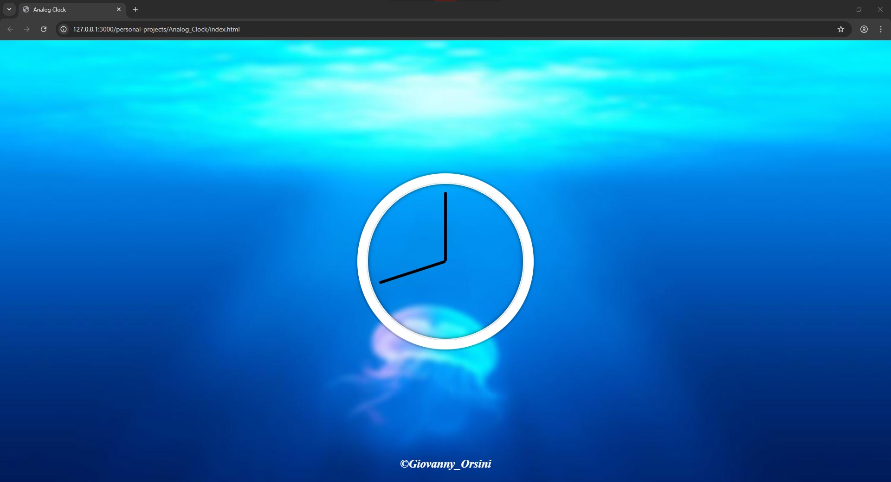

# 🕒 Analog Clock

A simple and fun **Analog Clock** project built with **HTML, CSS, and JavaScript**.  
The clock updates in real time using JavaScript, with styled hands for **hours, minutes, and seconds**.

---

## 🚀 Features

- Real-time working analog clock
- Smooth movement of hands (hours, minutes, seconds)
- Clean design with **HTML + CSS + JavaScript** only
- Lightweight and responsive

---

## 📂 Project Structure

- `index.html` – Main page
- `style.css` – Styles for the clock design
- `script.js` – JavaScript logic to keep the clock running

---

## 🖼️ Screenshot

---

## 🎯 How to Use

1. Clone or download this repository
2. Open `index.html` in your browser
3. Watch the clock tick in real-time!

---

## 🛠️ Technologies Used

- HTML
- CSS
- JavaScript
