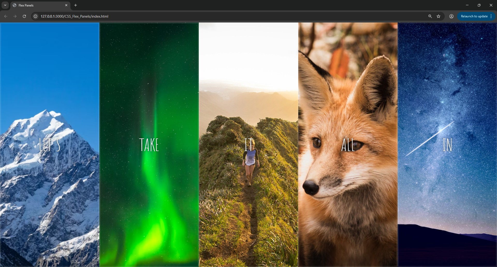
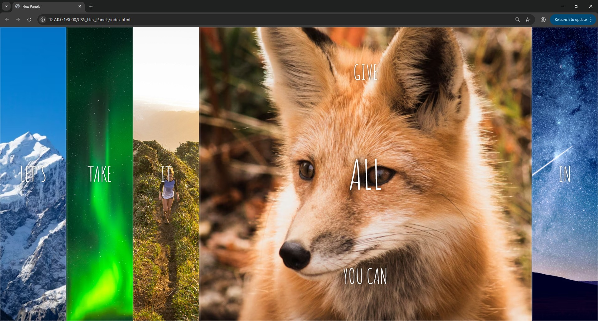

# 🎬 Animated Flex Panels

A visually engaging project demonstrating **CSS Flexbox** and **smooth animations**.  
Each panel expands when clicked, revealing hidden text, and collapses back when clicked again.

---

## 🚀 Features
- Animated **expand/collapse** behavior on click  
- Built entirely with **HTML**, **CSS (Flexbox + transitions)**, and a bit of **JavaScript**  
- Responsive layout that adapts to screen size  
- Clean and minimal design  

---

## 📂 Project Structure
- `index.html` – Contains HTML, CSS, and JavaScript all in one file  

---

## 🖼️ Screenshots

---

## 🎯 How to Use
1. Open `index.html` in your browser  
2. Click on any panel to expand it and reveal hidden text  
3. Click again to collapse it back  

---

## 🛠️ Technologies Used
- HTML  
- CSS (Flexbox, Transitions)  
- JavaScript (Event Listeners, Class Toggle)
