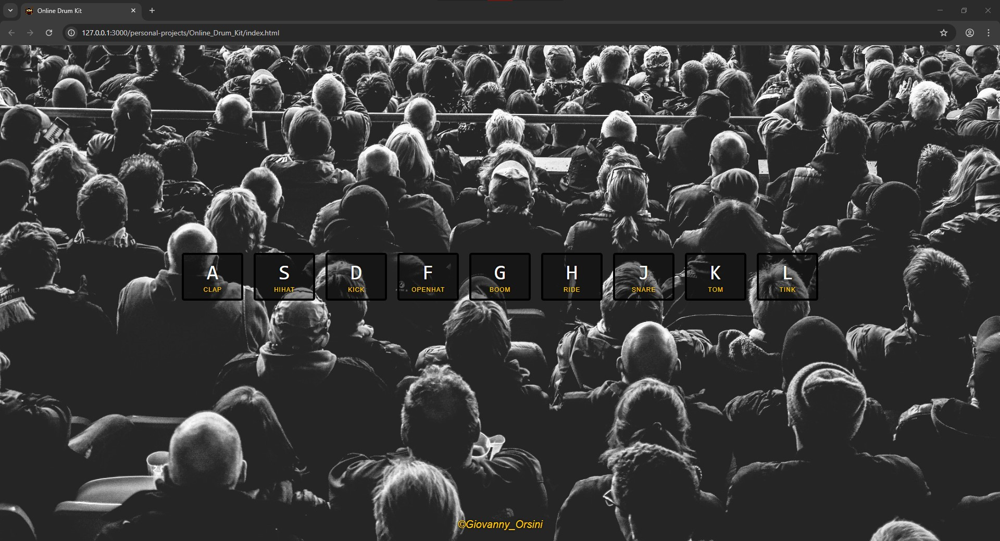

# 🥁 Online Drum Kit

An interactive project that turns your keyboard into a drum kit.  
Press the keys **A, S, D, F, G, H, J, K, L** to play different drum sounds.  

Features:
- **Real drum sounds** loaded from local files  
- **Keyboard event listeners** (`keydown`)  
- **Animation effect** when pressing a key (button grows and shows a yellow border)

---

## 🛠️ Tech Stack
- HTML  
- CSS  
- JavaScript (event listeners + DOM manipulation)  
- Audio files

---

## ▶️ How to Run
1. Open `index.html` in your browser  
2. Press the keys **A–L** on your keyboard  
3. Play your own drum rhythms 🎶 

---

## 📸 Screenshots
- Main view:   
- Pressed key effect: 