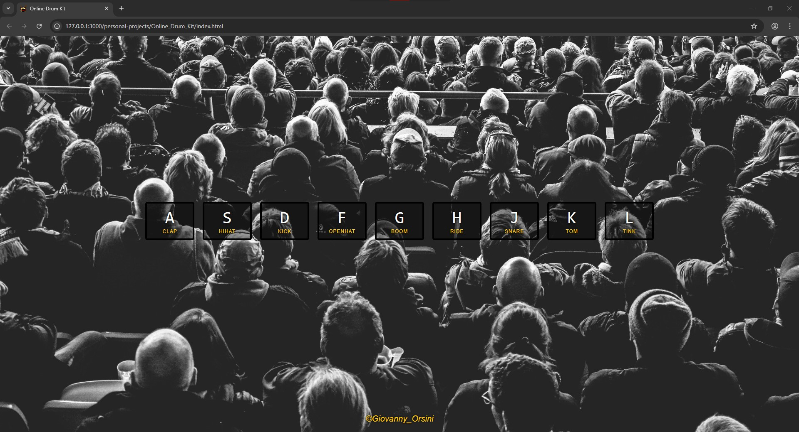
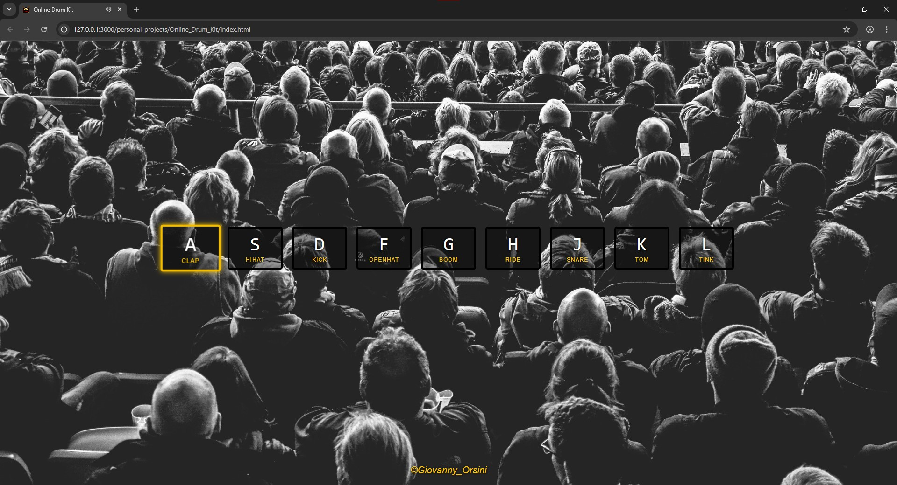

# Personal Projects

This repository contains some of my first personal projects as I continue learning and practicing **web development**.  
Each project is built with **HTML, CSS, and JavaScript**, focusing on improving my understanding of the fundamentals while creating fun and interactive applications.

---

## 📂 Projects

### 1. 🖱️ Click Counter
A simple project that:
- Increases the counter each time you press the **"Click"** button  
- Resets the counter when pressing the **"Reset"** button  

**Tech stack:**  
- HTML  
- CSS  
- JavaScript (basic DOM manipulation)

**Files included:**  
- `index.html`  
- `style.css`  
- `script.js`  

**Screenshot:**  
<a href="Click_Counter/index.html">
    
</a>

---

### 2. 🥁 Online Drum Kit
A more structured project that allows you to:
- Play drum sounds using the keyboard keys (**A, S, D, F, G, H, J, K, L**)  
- See a quick **animation effect** when a key is pressed (button grows slightly and gets a yellow border)  
- Hear realistic drum sounds loaded from a local sounds folder  

**Tech stack:**  
- HTML  
- CSS  
- JavaScript (DOM manipulation + event listeners)  
- Audio files (drum sounds)

**Files included:**  
- `index.html`  
- `style.css`  
- `script.js`  
- `/sounds` folder (drum sounds)

**Screenshots:**  
- Main view: <a href="Online_Drum_Kit/index.html">
                
             </a>  
- Pressed key effect: <a href="Online_Drum_Kit/index.html">
                        
                      </a>

---

## 🚀 How to Run
1. Clone this repository:
   ```bash
   git clone https://github.com/giovannyorsini/personal_projects.git

## 📫 Contact
- **LinkedIn:** [My LinkedIn profile](https://www.linkedin.com/in/giovanny-orsini)
- **Email:** gikaorsini@gmail.com